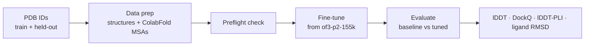

<div align="center">

# openfold3-finetune-kit

**Target-specific fine-tuning for [OpenFold3](https://github.com/aqlaboratory/openfold-3) — data prep, training, and rigorous evaluation in one reproducible pipeline.**

_Curated and maintained by [Recep Adiyaman](https://recep2244.github.io/portfolio/)._

[](LICENSE)
[](https://github.com/recep2244/openfold3-finetune-kit/actions/workflows/ci.yml)
[](https://recep2244.github.io/openfold3-finetune-kit/docs/)
[](https://colab.research.google.com/github/recep2244/openfold3-finetune-kit/blob/main/notebooks/02_finetune_pipeline.ipynb)
[](https://www.python.org/)
[](https://developer.nvidia.com/cuda-toolkit)

</div>

## Overview

OpenFold3 is the Apache-2.0, all-atom co-folding model (the open reproduction of AlphaFold3). Like all co-folding models it **interpolates well but extrapolates poorly** — accuracy degrades on chemistry far from its training distribution. This kit closes that gap for a *specific* target: a short, gentle fine-tune on ~10 protein–ligand complexes corrects systematic pose errors at the binding interface, then proves the gain on a held-out set.

It reproduces the published low-N recipe (≈350 steps, ≈20 h on one 80 GB GPU) and wraps the entire workflow — data preparation, MSA retrieval, training, and baseline-vs-fine-tuned scoring — behind a single command, with a real end-to-end setup verifier.



## Features

- **Single-command pipeline** — `run_all.sh` chains prepare → check → train → evaluate, failing fast with actionable messages.
- **No alignment databases** — MSAs are fetched from the ColabFold server; templates are disabled throughout, and training never contacts the network.
- **Verifiable setup** — `verify_setup.sh` runs an actual prediction and reports a PASS/FAIL summary.
- **Reproducible environments** — pixi-managed CUDA stack; configs cite the exact upstream source keys they override.
- **Three execution paths** — local, [notebooks](notebooks/) (Colab/Kaggle/Paperspace/…), or [Docker](docker/).
- **Deployment-ready** — Hugging Face Gradio Space and a checkpoint-publishing script included.

## Requirements

| GPU memory | Capability | Config |
|---|---|---|
| ~80 GB (H100 / A100-80GB) | Full fine-tune (reference recipe) | `configs/finetune_lowN_single_gpu.yml` |
| ≥ 24 GB | Reduced fine-tune (smaller token budget) | `configs/finetune_lowN_single_gpu.yml` |
| 12–16 GB | Smoke test only (validates the pipeline) | `configs/finetune_test_12gb.yml` |

CUDA ≥ 12.1, Linux. Inference is far lighter than training and runs on 12 GB. See the [Cloud GPU guide](https://recep2244.github.io/openfold3-finetune-kit/docs/cloud/) for renting an 80 GB instance.

## Installation

```bash
curl -fsSL https://pixi.sh/install.sh | sh && pixi self-update   # pixi >= 0.68 required
git clone https://github.com/aqlaboratory/openfold-3.git ~/openfold-3
( cd ~/openfold-3 && pixi run -e openfold3-cuda12 setup_openfold )  # installs env + downloads weights

git clone https://github.com/recep2244/openfold3-finetune-kit.git
cd openfold3-finetune-kit && make verify
```

> The pixi environment ships a matched CUDA toolkit and cutlass. **Do not export a system `CUDA_HOME` over it** — that breaks the evoformer kernel build. See [Troubleshooting](https://recep2244.github.io/openfold3-finetune-kit/docs/troubleshooting/).

## Usage

Edit `TRAIN_IDS` / `VAL_IDS` (and `GPU_PROFILE`) in `scripts/run_all.sh`, then:

```bash
bash scripts/run_all.sh
```

| Script | Purpose |
|---|---|
| `scripts/verify_setup.sh` | Validate the install + run a real smoke prediction |
| `scripts/run_all.sh` | End-to-end pipeline (prepare → check → train → evaluate) |
| `scripts/prepare_data.sh` | Download structures + fetch ColabFold MSAs |
| `scripts/check_data.sh` | Preflight data integrity check |
| `scripts/evaluate.sh` | Score baseline vs fine-tuned on the held-out set |
| `scripts/run_small_test.sh` | Minimal end-to-end smoke test on tiny data |
| `scripts/qc_gate.py` | Composite QC gate + ranker for predictions |
| `scripts/ipsae_score.sh` | Reference-free interface confidence (ipSAE) |
| `scripts/foldseek_search.sh` | Structural homolog / novelty search |

See [Scoring & QC](https://recep2244.github.io/openfold3-finetune-kit/docs/scoring/) for the scientific tooling.

## Notebooks

Prefer a notebook? The same workflow runs on any hosted GPU platform (Colab, Kaggle, Paperspace, SageMaker Studio Lab, Lightning AI). Each notebook mirrors a script.

| Notebook | Does | Script equivalent | |
|---|---|---|---|
| [`01_setup_and_verify`](notebooks/01_setup_and_verify.ipynb) | Install + weights + smoke prediction | `verify_setup.sh` | [](https://colab.research.google.com/github/recep2244/openfold3-finetune-kit/blob/main/notebooks/01_setup_and_verify.ipynb) |
| [`02_finetune_pipeline`](notebooks/02_finetune_pipeline.ipynb) | Full pipeline: prepare → check → fine-tune → evaluate | `run_all.sh` | [](https://colab.research.google.com/github/recep2244/openfold3-finetune-kit/blob/main/notebooks/02_finetune_pipeline.ipynb) |
| [`03_inference`](notebooks/03_inference.ipynb) | Predict a structure and view it in 3D | `run_openfold predict` | [](https://colab.research.google.com/github/recep2244/openfold3-finetune-kit/blob/main/notebooks/03_inference.ipynb) |

A free T4 (16 GB) runs the smoke profile only; a real fine-tune needs an A100/H100. On Kaggle/Paperspace/others, import the notebook from its GitHub URL and enable a GPU. Details: [notebooks guide](https://recep2244.github.io/openfold3-finetune-kit/docs/notebooks/) · [`notebooks/README.md`](notebooks/README.md).

## Results

A successful target fine-tune improves **interface** metrics (the protein–ligand contact and pose) without regressing global accuracy. The table below is an **illustrative pattern of the expected direction** — not measured benchmarks; your actual deltas depend on the target, the training set, and held-out difficulty.

| Metric | Baseline | Fine-tuned | Δ | Direction |
|---|---|---|---|---|
| lDDT | 0.71 | 0.74 | +0.03 | higher is better |
| DockQ (avg) | 0.41 | 0.58 | +0.17 | higher is better |
| lDDT-PLI | 0.55 | 0.72 | +0.17 | higher is better |
| Ligand RMSD (Å) | 3.20 | 1.10 | −2.10 | lower is better |

The scientific rationale: co-folding accuracy degrades with distance from the training distribution, and the largest, most correctable errors concentrate at the binding **interface** — so a gentle, interface-weighted fine-tune lifts DockQ / lDDT-PLI and lowers ligand RMSD while global lDDT holds. Your real per-structure scores are written to `<work>/eval/out/results.csv`; always confirm global lDDT did not drop (regression check) and run the [forgetting check](https://recep2244.github.io/openfold3-finetune-kit/docs/pipeline/#forgetting-check).

## Documentation

Landing page: **https://recep2244.github.io/openfold3-finetune-kit/** · Full docs: **https://recep2244.github.io/openfold3-finetune-kit/docs/**
— [Getting started](https://recep2244.github.io/openfold3-finetune-kit/docs/getting-started/) ·
[Tutorial](https://recep2244.github.io/openfold3-finetune-kit/docs/tutorial/) ·
[How it works](https://recep2244.github.io/openfold3-finetune-kit/docs/pipeline/) ·
[Configuration](https://recep2244.github.io/openfold3-finetune-kit/docs/configuration/) ·
[Scoring & QC](https://recep2244.github.io/openfold3-finetune-kit/docs/scoring/) ·
[Troubleshooting](https://recep2244.github.io/openfold3-finetune-kit/docs/troubleshooting/)

## Project layout

```
scripts/      pipeline + verification (run_all, prepare_data, check_data, evaluate, verify_setup, run_small_test)
configs/      fine-tune YAMLs (single-GPU, multi-GPU, anti-forgetting, 12 GB test)
docs/         MkDocs site sources
notebooks/    cloud notebooks: 01 setup/verify, 02 full pipeline, 03 inference
docker/       Dockerfile, compose, entrypoint
huggingface/  Gradio Space, model card, checkpoint upload script
examples/     default target (PDE10A) ID lists
```

## Citation

```bibtex
@software{openfold3_finetune_kit,
  author  = {Adiyaman, Recep},
  title   = {openfold3-finetune-kit: Target-specific fine-tuning for OpenFold3},
  url      = {https://github.com/recep2244/openfold3-finetune-kit},
  license  = {Apache-2.0}
}
```

Please also cite [OpenFold3](https://github.com/aqlaboratory/openfold-3).

## About

I put this kit together because target-specific OpenFold3 fine-tuning involves a lot of
fiddly, easy-to-get-wrong plumbing — data preprocessing, MSAs, checkpoint loading quirks,
and evaluation — and I wanted a path that just works and is reproducible end-to-end. Every
config key and flag here was checked against the OpenFold3 source, and the setup was verified
on real hardware (down to a 12 GB laptop GPU for the smoke test). If it saves you an afternoon
of debugging, it did its job. Issues and PRs are welcome.

— Recep Adiyaman ([@recep2244](https://github.com/recep2244))

## Contributing & license

Contributions are welcome — see [CONTRIBUTING.md](CONTRIBUTING.md) and run `make lint` before opening a PR. Licensed under [Apache-2.0](LICENSE).

## Maintainer & acknowledgements

Curated and maintained by **[Recep Adiyaman](https://recep2244.github.io/portfolio/)** — [more projects](https://github.com/recep2244?tab=repositories).

Built on [OpenFold3](https://github.com/aqlaboratory/openfold-3) by the OpenFold Consortium / AlQuraishi Lab. Fine-tuned weights derive from the public `openfold3-p2-155k` checkpoint; retain that attribution when redistributing.

**Links:** [Portfolio](https://recep2244.github.io/portfolio/) · [GitHub profile](https://github.com/recep2244) · [All repositories](https://github.com/recep2244?tab=repositories) · [OpenFold3 (upstream)](https://github.com/aqlaboratory/openfold-3) · [Documentation](https://recep2244.github.io/openfold3-finetune-kit/docs/)
