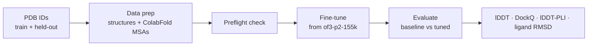

# openfold3-finetune-kit

**Target-specific fine-tuning for [OpenFold3](https://github.com/aqlaboratory/openfold-3) — data preparation, training, and rigorous evaluation in one reproducible pipeline.**

OpenFold3 is the Apache-2.0, all-atom co-folding model (an open reproduction of AlphaFold3). Like all co-folding models it interpolates well but extrapolates poorly: accuracy drops on chemistry far from its training distribution. This kit closes that gap for a *specific* target — a short, gentle fine-tune on ~10 protein–ligand complexes corrects systematic interface errors, then proves the gain on a held-out set.

## Where to go next

- **[Getting started](getting-started.md)** — install OpenFold3 and verify the setup.
- **[Tutorial](tutorial.md)** — a full worked run on the PDE10A example target.
- **[How it works](pipeline.md)** — the four pipeline stages and the MSA/templates policy.
- **[Configuration](configuration.md)** — the fine-tune YAMLs and the knobs that matter.
- **[Usage reference](usage.md)** — every script and its environment variables.
- **[Troubleshooting](troubleshooting.md)** — the failure modes you are most likely to hit.

## Design principles

- **No alignment databases.** MSAs come from the ColabFold server; templates are off everywhere; training never touches the network.
- **Verify before you spend GPU hours.** A preflight check guards the known data pitfalls, and `verify_setup.sh` runs a real prediction end-to-end.
- **Nudge, don't retrain.** Low learning rate, short warmup, faster EMA, interface-biased crops — adapt to the target without catastrophic forgetting.
