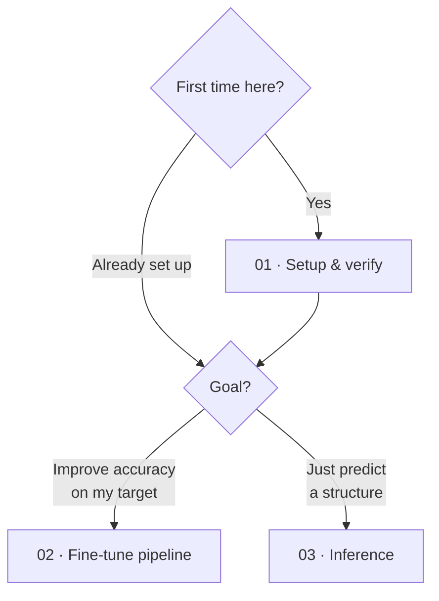
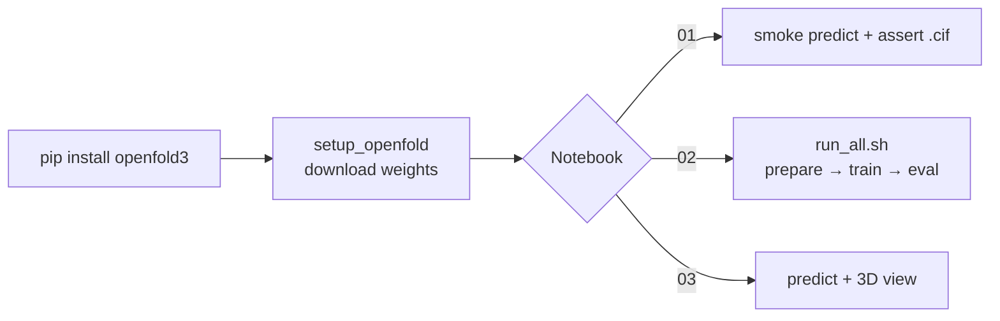

# Notebooks

Run the entire workflow from a browser — no terminal, no local CUDA setup. The notebooks are
**platform-agnostic** (Google Colab, Kaggle, Paperspace Gradient, SageMaker Studio Lab,
Lightning AI) and each one is a faithful mirror of a shell script, so you can move between the
notebook and CLI forms at any time.

-   :material-check-decagram: __01 · Setup & verify__

    ---

    Install OpenFold3, download the weights, and run a real smoke prediction to confirm the
    environment works end-to-end.

    *Mirrors* `scripts/verify_setup.sh` · *Runs on a T4*

    [:simple-googlecolab: Open in Colab](https://colab.research.google.com/github/recep2244/openfold3-finetune-kit/blob/main/notebooks/01_setup_and_verify.ipynb){ .md-button .md-button--primary }

-   :material-cog-sync: __02 · Fine-tune pipeline__

    ---

    The full run: data prep → preflight → fine-tune → baseline-vs-fine-tuned evaluation, driven
    by a single parameters cell.

    *Mirrors* `scripts/run_all.sh` · *A100/H100 for a real run*

    [:simple-googlecolab: Open in Colab](https://colab.research.google.com/github/recep2244/openfold3-finetune-kit/blob/main/notebooks/02_finetune_pipeline.ipynb){ .md-button .md-button--primary }

-   :material-cube-scan: __03 · Inference__

    ---

    Predict a structure from a sequence (optionally with a ligand) and inspect it in an
    interactive 3D viewer.

    *Mirrors* `run_openfold predict` · *Runs on a T4*

    [:simple-googlecolab: Open in Colab](https://colab.research.google.com/github/recep2244/openfold3-finetune-kit/blob/main/notebooks/03_inference.ipynb){ .md-button .md-button--primary }

## Which notebook do I need?

| Notebook | Outcome | CLI equivalent | Minimum GPU | Typical runtime |
|---|---|---|---|---|
| **01 · Setup & verify** | A confirmed install + one predicted structure | `verify_setup.sh` | T4 (16 GB) | ~5–10 min (incl. install) |
| **02 · Fine-tune pipeline** | Fine-tuned checkpoint + score table | `run_all.sh` | T4 = smoke only; A100 = real | smoke ~min; real run hours |
| **03 · Inference** | Predicted `.cif` + 3D view | `run_openfold predict` | T4 (16 GB) | ~1–3 min per structure |

## Run on your platform

=== ":simple-googlecolab: Colab"

    1. Click an **Open in Colab** button above.
    2. `Runtime → Change runtime type → GPU` (T4 is free; A100 needs Colab Pro+).
    3. `Runtime → Run all`.

    Notebook 02 mounts Google Drive to persist the checkpoint and `results.csv`.

=== ":simple-kaggle: Kaggle"

    1. *New Notebook → File → Import Notebook → GitHub* and paste the notebook URL.
    2. In the sidebar, set **Accelerator → GPU** and **Internet → On** (required for the MSA fetch).
    3. Run all cells.

=== ":material-cloud: Paperspace / Lightning"

    1. Start a notebook on a **GPU instance**.
    2. In a cell: `!git clone https://github.com/recep2244/openfold3-finetune-kit.git` (or upload the `.ipynb`).
    3. Open the notebook and run all cells.

=== ":fontawesome-brands-aws: SageMaker Studio Lab"

    1. Clone the repo from the launcher's Git panel.
    2. Open the notebook and select a **GPU** runtime.
    3. Run all cells.

!!! warning "GPU size determines what you can do"
    A free **T4 (16 GB)** runs **inference** and the **smoke** fine-tune profile
    (`GPU_PROFILE="small"`) only. A genuine fine-tune (the published low-N recipe) needs an
    **A100/H100 (≈80 GB)**. The fine-tune notebook defaults to `small` so it never hard-crashes
    on a free runtime — switch to `big` only on a large GPU.

## What happens inside each notebook

- **Install** uses the pip path (`pip install "openfold3[cuequivariance]"`) — the most reliable
  route on hosted platforms. For a local workstation, the pixi setup in
  [Getting started](getting-started.md) is preferable.
- **Weights** come from `setup_openfold`, which is interactive; the notebooks answer its prompts
  non-interactively (default cache, default checkpoint, skip integration tests).
- **Parameters** (notebook 02) — `TRAIN_IDS`, `VAL_IDS`, and `GPU_PROFILE` live in one editable
  cell; everything downstream reads from it.

## Insights & good practice

!!! tip "Verify, don't trust the exit code"
    `run_openfold` can exit `0` even when a prediction fails. Every notebook **asserts that a
    `.cif` was actually written** before continuing — mirroring the check in `verify_setup.sh`.
    If an assertion fires, read `out/**/logs/predict_err_rank0.log`.

!!! tip "Persist before the session ends"
    Hosted disks are ephemeral. Notebook 02 copies the checkpoint and `eval/out/results.csv` to
    Google Drive on Colab; on other platforms, download them from the file browser before the
    runtime recycles.

!!! note "MSAs need internet, your data may not want the public server"
    Alignments are fetched from the public ColabFold server (templates are off). For proprietary
    sequences, don't use the public server — run the local MSA path (`MSA_MODE=snakemake`) on your
    own infrastructure instead.

!!! info "Reproducibility"
    Seeds are fixed in the pipeline; the same inputs on the same GPU class reproduce results.
    Notebooks are committed with cleared outputs, so a fresh run starts from a clean state.

## Let's collaborate

I curate this kit personally and keep it running on real hardware — from an 80 GB cloud GPU
down to a 12 GB laptop. If a notebook saved you time, I'd genuinely like to hear about it; and
if something's missing or rough, that's exactly the feedback that makes it better.

- :octicons-issue-opened-16: **Hit a snag or a rough edge?** [Open an issue](https://github.com/recep2244/openfold3-finetune-kit/issues/new/choose) — the templates make it a two-minute report.
- :octicons-git-pull-request-16: **Improved a notebook or a script?** Pull requests are very welcome — run `make lint` first and tell me what you tested.
- :material-flask-outline: **Working on co-folding, docking, or target-specific fine-tuning?** I'd love to compare notes or help adapt the kit to your system — reach out on any channel below.

[:material-web: Portfolio](https://recep2244.github.io/portfolio/){ .md-button .md-button--primary }
[:fontawesome-brands-linkedin: LinkedIn](https://www.linkedin.com/in/recep-ad%C4%B1yaman/){ .md-button }
[:fontawesome-brands-x-twitter: X](https://x.com/RcpAdymn){ .md-button }
[:simple-googlescholar: Scholar](https://scholar.google.com/citations?user=4UUzdMsAAAAJ&hl=en){ .md-button }
[:fontawesome-brands-github: GitHub](https://github.com/recep2244){ .md-button }
[:material-email: Email](mailto:recepadiyaman2244@gmail.com){ .md-button }

---

**Keep exploring:** [Getting started](getting-started.md){ .md-button } [Tutorial](tutorial.md){ .md-button } [Troubleshooting](troubleshooting.md){ .md-button }
