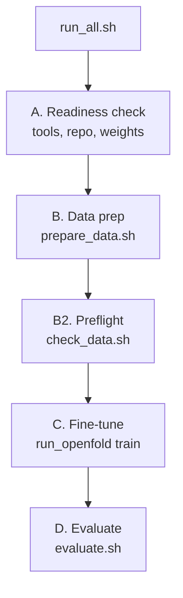

# How it works

`scripts/run_all.sh` orchestrates four stages and stops with a plain-English message if
any of them fails.

## A. Readiness check
Confirms `run_openfold` is on `PATH`, the OpenFold3 repo and weights exist, and selects the
fine-tune config from `GPU_PROFILE` (`big` → `configs/finetune_lowN_single_gpu.yml`,
`small` → `configs/finetune_test_12gb.yml`).

## B. Data preparation
`prepare_data.sh` downloads each PDB structure, preprocesses it into OpenFold3's `.npz`
format with reference molecules, and retrieves MSAs.

!!! info "MSAs only — no databases, no templates"
    Alignments are fetched from the **ColabFold server** (`run_openfold align-msa-server`).
    Templates are disabled everywhere (`n_templates: 0`, `--use-templates False`), so the
    only external dependency is the MSA fetch. **Training itself never contacts the network** —
    it reads the alignment arrays saved during this stage.

## B2. Preflight
`check_data.sh` verifies every required artifact exists and is non-empty — preprocessed
structures, reference molecules, alignment arrays, and dataset caches — and guards known
OpenFold3 input pitfalls (dots in query names, chain-level MSA keys, alignment formats)
*before* any GPU time is spent.

## C. Fine-tune
`run_all.sh` renders a runner YAML from the chosen config with your data paths, then calls
`run_openfold train`. The recipe loads the public `of3-p2-155k.pt` weights directly
(`manual_checkpoint_loading: true`) and applies the low-N overrides described in
[Configuration](configuration.md). Checkpoints are written under `<work>/train_out/checkpoints/`.

## D. Evaluation
`evaluate.sh` predicts each held-out structure with both the **baseline** and the
**fine-tuned** checkpoint (5 diffusion samples each), scores them against the experimental
structures with OpenStructure, and prints a comparison table. Interface lDDT, DockQ, and
lDDT-PLI should rise and ligand RMSD should fall while global lDDT holds steady.

## Interpreting the scores

Two different families of numbers appear, and they answer different questions.

**Prediction confidence** — emitted by the model with every prediction, *no experimental
structure required*. Use these to triage predictions you can't yet validate:

| Metric | What it is | Standard | Stringent |
|---|---|---|---|
| pLDDT | Per-residue confidence (0–100) | > 85 | > 90 |
| pTM | Global fold confidence (0–1) | > 0.70 | > 0.80 |
| ipTM | Interface confidence (0–1) | > 0.50 | > 0.60 |
| PAE (interface) | Predicted aligned error (Å) | < 12 | < 10 |

**Evaluation metrics** — computed by `evaluate.sh` *against the experimental structure* on the
held-out set; this is how you judge the fine-tune:

| Metric | Range | Good | Direction |
|---|---|---|---|
| lDDT (global) | 0–1 | should **hold** vs baseline | higher |
| interface lDDT | 0–1 | rises with a good fine-tune | higher |
| DockQ | 0–1 | ≥0.49 medium, ≥0.80 high (CAPRI) | higher |
| lDDT-PLI | 0–1 | rises with a good fine-tune | higher |
| ligand RMSD | Å | < 2 Å is a correct pose | lower |

!!! warning "Scores are filters, not affinity predictors"
    Individual confidence metrics have only modest correlation with experimental success
    (single-metric ROC AUC ≈ 0.65). Treat them as **pre-screening filters** that eliminate
    poor predictions, not as a ranking of binding affinity. Judge a fine-tune on the *shift*
    in interface metrics across the held-out set — and always confirm global lDDT did not drop.

## Forgetting check
A fine-tune adapts to one target and may regress on unrelated ones. After a run, predict a
few unrelated targets with both checkpoints to confirm general performance is preserved.
